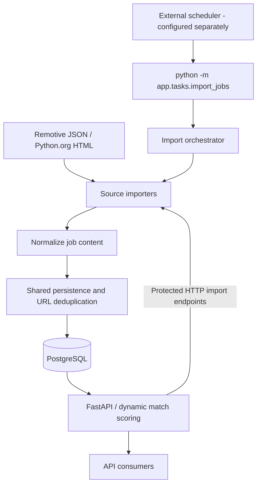

# Job Radar

Job Radar aggregates job offers from Remotive and Python.org, normalizes their
content, and stores them in PostgreSQL. A FastAPI REST API exposes the offers
with a deterministic match score for a junior remote Python/backend profile.

This small backend portfolio MVP focuses on persistence, repeatable imports,
explicit failure handling, and automated tests. Python 3.12 is the target runtime.

## Key features

- FastAPI REST API with Pydantic schemas and interactive Swagger documentation.
- PostgreSQL persistence through SQLAlchemy 2.x and Alembic migrations.
- Remotive JSON and Python.org HTML importers with shared URL deduplication.
- Plain-text normalization, seniority inference, and dynamic `match_score` values.
- Remote, seniority, and text filters; pagination; date and score sorting.
- Import CLI for external schedulers, with independent source execution.
- HTTP import endpoints protected by an environment-configured secret.
- Docker Compose development environment and pytest tests run by GitHub Actions.

## Architecture



The CLI and HTTP endpoints reuse the same import services. Scheduling runs
outside the FastAPI process; the repository does not install or start a scheduler.

## Project structure

```text
app/
  main.py                    FastAPI application and health endpoint
  api/                       Job routes, DB dependency, import authentication
  core/config.py             Environment and .env configuration
  db/                        SQLAlchemy base and session setup
  models/job.py              Persisted job model
  schemas/job.py             Request, response, and import summary schemas
  services/
    job_import.py            Remotive importer and shared persistence
    python_org_import.py     Python.org HTML importer
    job_normalization.py     Content cleaning and seniority inference
    job_scoring.py           Deterministic matching rules
    import_runner.py         Independent execution of both sources
  tasks/import_jobs.py       One-shot import CLI
alembic/                     Database migrations
tests/                       API, service, CLI, and migration tests; HTML fixture
.github/workflows/ci.yml      Python 3.12 test workflow
Dockerfile                   Python 3.12 image running as a non-root user
docker-compose.yml           API and PostgreSQL services
.env.example                 Configuration template
```

## Match scoring

`match_score` ranges from **0 to 100** and targets a junior remote Python/backend
developer. It is computed dynamically from the title, description, remote flag,
and seniority; it is not stored in the database.

A job qualifies for scoring when its title contains `backend`, `back-end`,
`back end`, `python`, `software engineer`, `software developer`, `developer`, or
`devops`, or its title/description contains `python`, `fastapi`, or `sqlalchemy`.
Otherwise its score is zero, even when it is remote or marked junior.

| Signal | Points |
| --- | --- |
| Technologies in title/description, each counted once | Python +20; FastAPI +10; PostgreSQL +10; SQLAlchemy +5; Docker +5; AWS +3; Git +2 |
| Relevant title matching the terms above | +15 |
| Remote | +10 |
| Junior / intern | +20 / +10 |
| Unknown or unrecognized seniority | 0 |
| Senior | -15 |
| Lead, staff, or principal | -25 |

Matches are case-insensitive and use word boundaries. Scoring removes HTML noise,
URLs, and legacy `Source:` lines; company and location do not contribute points.
The final sum is clamped to 0–100. This is deterministic keyword relevance,
not semantic or AI analysis.

Score sorting loads all filtered candidates into memory, calculates scores,
sorts, then paginates. Its memory and processing cost grow with the filtered
result set; date sorting and pagination run in SQL.

## API

| Method | Endpoint | Behavior |
| --- | --- | --- |
| GET | `/health` | Returns `{"status":"ok"}`; does not check the database |
| POST | `/jobs` | Creates a job (201); duplicate URL returns 409 |
| GET | `/jobs` | Returns a filtered, sorted, paginated JSON list |
| GET | `/jobs/{job_id}` | Returns a job, or 404 |
| POST | `/jobs/import` | Imports Remotive; requires `X-Import-Secret` |
| POST | `/jobs/import/python-org` | Imports Python.org; requires `X-Import-Secret` |

Job creation requires `title`, `company`, `location`, `seniority`, `description`,
and `url` strings. `remote` is optional and defaults to false. Responses include
these fields plus `id`, `created_at`, and `match_score`. Seniority is stored as
plain text. Use Swagger to inspect schemas and submit requests.

### Filtering, pagination, and sorting

| Parameter | Behavior |
| --- | --- |
| `remote` | `true` or `false` |
| `seniority` | Case-insensitive exact match |
| `q` | Case-insensitive substring in title, company, location, or description |
| `limit` | Default 20; allowed 1–100 |
| `offset` | Default 0; must be nonnegative |
| `sort` | `created_at` (default) or `match_score` |
| `order` | `desc` (default) or `asc` |

Filters combine with AND; `q` matches any of its four fields. `%` and `_` are
literal search characters, and an empty `q` matches all jobs. Invalid pagination
or sorting values return 422. Technology searches use `q`; there is no separate
technology parameter.

```text
GET /jobs?remote=true
GET /jobs?seniority=junior&q=python
GET /jobs?remote=true&seniority=junior&q=fastapi&limit=10&offset=10
GET /jobs?sort=match_score&order=desc
GET /jobs?sort=created_at&order=asc
```

Date ties use ID in the same direction. Score ties always use newest creation
time first, then descending ID, including when score order is ascending.

### HTTP import authentication

Set a long random `IMPORT_SECRET` in the server environment or `.env`, then send
its exact value in `X-Import-Secret`. Comparison uses `secrets.compare_digest`.
Swagger's **Authorize** button also accepts this credential.

```bash
# Bash: assumes IMPORT_SECRET is already exported in this shell.
curl -X POST -H "X-Import-Secret: $IMPORT_SECRET" http://localhost:8000/jobs/import
curl -X POST -H "X-Import-Secret: $IMPORT_SECRET" http://localhost:8000/jobs/import/python-org
```

PowerShell can use `Invoke-RestMethod` with an environment variable:

```powershell
Invoke-RestMethod -Method Post -Uri http://localhost:8000/jobs/import -Headers @{"X-Import-Secret" = $env:IMPORT_SECRET}
```

The server's `.env` does not automatically populate your shell environment.
Missing or incorrect headers return 403. An unset or blank server secret disables
HTTP imports with 503. Use HTTPS for public access and keep the secret out of
source control and logs.

**This protection applies only to imports.** `POST /jobs` and read endpoints
remain unauthenticated; there is no user/account system.

## Sources and data handling

| Source | Imported content and boundaries |
| --- | --- |
| [Remotive](https://github.com/remotive-com/remote-jobs-api) | Reads the public `jobs` JSON array. Maps company and location fields, sets remote to true, and converts descriptions to plain text. Invalid records and empty descriptions are skipped. The example configuration requests 20 software jobs. |
| [Python.org](https://www.python.org/jobs/) | Fetches one HTML listing page using HTTPX and BeautifulSoup. No pagination or detail crawling. Descriptions contain available categories and may be empty. Remote is inferred from title/location wording, with explicit negations handled. |

Both importers infer seniority from title keywords, with precedence: principal,
staff, lead, senior/sr, junior/jr/entry-level, then intern/internship. Missing
signals mean `unknown`; remote and seniority heuristics can miss ambiguous roles.

Imports report `fetched`, `created`, and `skipped`; skipped includes malformed
records and duplicate URLs. Invalid source configuration returns 503 over HTTP;
provider failures or invalid responses return 502. Python.org also rejects
redirects, non-HTML responses, and missing listing markup.

Shared persistence checks exact, case-sensitive job URLs and uses the database
constraint `uq_jobs_url` plus per-record savepoints to recover from competing URL
inserts. Imported URLs are trimmed; aliases and tracking parameters are not
canonicalized. Other database failures roll back the batch.

Reimports skip existing URLs without updating or deleting jobs. `created_at`
is the local insertion time, not the provider's publication date. Existing rows
are not automatically refreshed after normalization changes or removed when a
source posting disappears. Follow each source's current usage and attribution
requirements when collecting or redistributing its content.

## Automated imports

Run once from the repository root with database and source settings configured
and migrations applied:

```bash
python -m app.tasks.import_jobs
```

For a running Docker stack:

```bash
docker compose exec -T app python -m app.tasks.import_jobs
```

- Remotive and Python.org are attempted sequentially, each with an independent
  database session that closes after the attempt and rolls back unfinished work.
- A source failure does not stop the remaining source or undo its committed work.
  Missing/invalid source settings count as failures.
- Each source prints its status and fetched/created/skipped counts. Failed
  attempts report the exception type and `unknown` counts.
- Exit status is 0 when both sources succeed and 1 if any source fails, after all
  attempts. Database initialization failure also exits 1.
- The CLI uses the database directly; it requires neither an HTTP import secret
  nor a running FastAPI server.

Configure cron, a systemd timer, or Windows Task Scheduler separately, using the
correct working directory, Python environment, and database access. Keep runs
infrequent (the example configuration advises at most four daily Remotive
fetches), prevent overlap in the scheduler, and capture output and exit codes.
There is no built-in retry loop or scheduling thread.

## Local setup

### Docker Compose

Requires Docker with Compose and Linux containers. Run commands from the
repository root. Copy the configuration template:

```powershell
Copy-Item .env.example .env
```

On macOS/Linux, use `cp .env.example .env`. Set `POSTGRES_PASSWORD` and matching
credentials in `DATABASE_URL`, URL-encoding credentials in the URL. Keep `db` as
the hostname. `POSTGRES_DB` and `POSTGRES_USER` must also match the URL.
Single-quote `.env` values containing `$` to avoid Compose interpolation.
Set `IMPORT_SECRET` only if HTTP imports should be enabled.

Build, start, and migrate:

```bash
docker compose up --build -d
docker compose exec app python -m alembic upgrade head
```

The API container waits for PostgreSQL health before starting Uvicorn on port
8000. Migrations are explicit and must run before using jobs or imports.

- [Swagger UI](http://localhost:8000/docs)
- [Health endpoint](http://localhost:8000/health)

Check the schema, view logs, or stop the stack:

```bash
docker compose exec app python -m alembic check
docker compose logs app db
docker compose down
```

PostgreSQL 17 stores data in `postgres_data`, which survives container recreation
and `docker compose down`. Compose does not publish the database port to the
host. Initialization credentials apply only to an empty volume; editing `.env`
does not change existing database credentials. Recreate the app with
`docker compose up --build -d` after configuration changes. `.env` is ignored by
Git and excluded from the image.

### Without Docker

Use Python 3.12 and a separately accessible PostgreSQL database. Copy and edit
`.env` as above, changing `DATABASE_URL` to your database host (`localhost` for
a local installation).

```bash
python -m venv .venv
```

Activate with `.\.venv\Scripts\Activate.ps1` on PowerShell, or
`source .venv/bin/activate` on macOS/Linux. Then run:

```bash
python -m pip install -r requirements.txt
python -m alembic upgrade head
fastapi dev app/main.py
```

Swagger is available at [localhost:8000/docs](http://localhost:8000/docs).

### Existing databases

Migration `0002` stops if duplicate URLs exist, without choosing or deleting
rows. Inspect conflicts before resolving them and retrying the migration:

```sql
SELECT url, count(*) FROM jobs GROUP BY url HAVING count(*) > 1;
```

PostgreSQL holds a table lock during this migration, so concurrent writes wait.

## Environment variables

Application settings load from the environment or the root `.env`; existing
environment values take precedence. See `.env.example` for placeholders.

| Variable | Purpose |
| --- | --- |
| `POSTGRES_DB` | Database initialized by Compose; template uses `job_radar` |
| `POSTGRES_USER` | Database user initialized by Compose; template uses `job_radar` |
| `POSTGRES_PASSWORD` | Database password; replace the template placeholder |
| `DATABASE_URL` | SQLAlchemy connection URL using `postgresql+psycopg://`; required for DB operations |
| `EXTERNAL_JOB_SOURCE_URL` | Remotive JSON endpoint; required for its import |
| `PYTHON_ORG_JOBS_URL` | Python.org listing URL; must point to `https://www.python.org/jobs/` |
| `IMPORT_SECRET` | Secret for HTTP imports; blank disables them; not required by the CLI |

The three `POSTGRES_*` variables initialize the Compose database; application
connections use `DATABASE_URL`. No provider API key is needed by these importers.

## Testing

With dependencies installed:

```bash
python -m pytest
```

Inside the running Python 3.12 Docker container:

```bash
docker compose exec app python -m pytest -p no:cacheprovider
```

The Docker command disables pytest's cache because application files are owned
by root and the container runs as a non-root user.

Tests cover API behavior, filters, sorting, scoring, normalization, deduplication,
source failure isolation, CLI exit codes, import authentication, and migrations.
HTTP responses are mocked and HTML comes from a local fixture. Database tests
use temporary SQLite databases, render PostgreSQL migration SQL, and verify the
Psycopg driver loads. They do not validate a live PostgreSQL server's runtime
behavior.

## CI

GitHub Actions runs on pushes and pull requests targeting `main`. The workflow
uses Ubuntu and Python 3.12, installs `requirements.txt`, and runs
`python -m pytest`. It does not deploy the application or run a live PostgreSQL
service.

## Design decisions and trade-offs

- **External scheduling:** a one-shot command keeps periodic imports separate
  from API workers. No Celery or Redis is needed for this MVP's sequential runs.
- **Deterministic scoring:** explicit rules keep the target profile explainable
  and testable; they do not understand semantic relevance.
- **In-memory score sorting:** keeps scoring in one place and is acceptable for
  the current small MVP scope, but needs revisiting for larger candidate sets.
- **HTML source dependency:** Python.org imports depend on external markup and
  may need selector updates when the page changes.
- **Insert-only imports:** exact URL deduplication makes repeated runs safe from
  duplicate rows, while leaving stale postings and URL aliases unresolved.

## Roadmap

Future work; these features are not implemented:

- Additional job sources.
- Configurable matching profiles.
- Notifications and alerts.
- A small web frontend.
- Public deployment.

## Support

Support links will be added before public launch. Buy Me a Coffee, Ko-fi, and
PayPal links are not configured yet.

## License

No `LICENSE` file is currently included in this repository.
